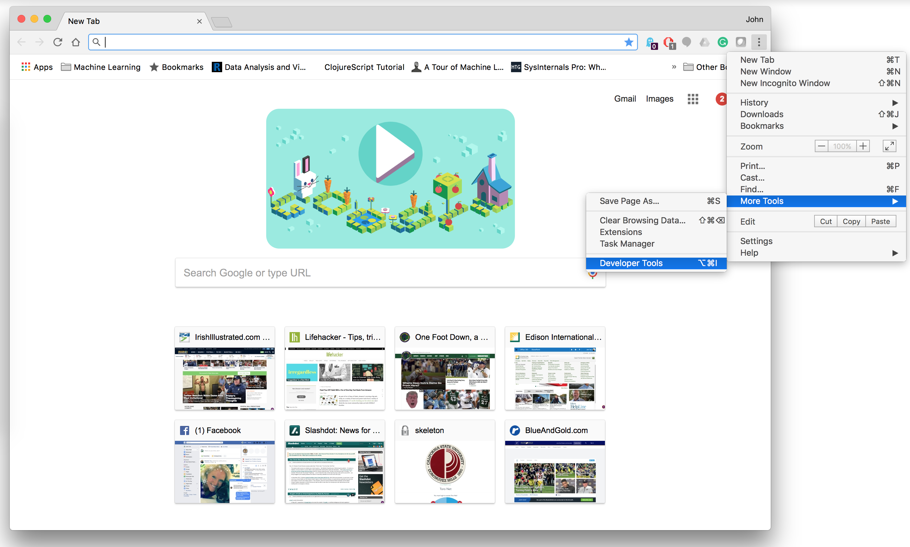
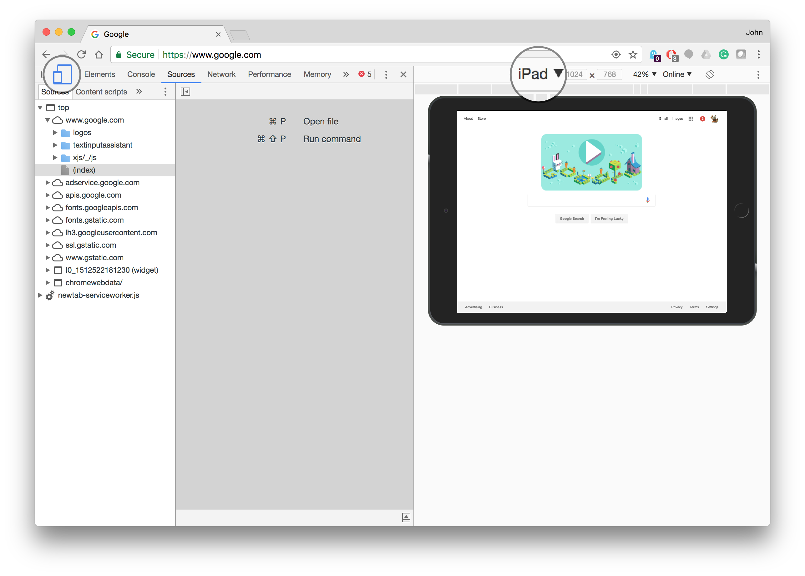

# sign-in

The `sign-in` application is a simple front-end application that runs on a mobile device, e.g., an iPad or an Android tablet that communicated with a back-end database.  This application is used as a kiosk device to collect information on visitors for a corporation.

## Visitor's View

The `sign-in` application presents to users a web form asking for some necessary information:

- Name
- Email 
- Telephone
- Company
- Official visit (checkbox)
- Escort required (checkbox)
- Escort name (if Escort is checked)

When a visitor hits `submit` the form is sent to the server and stored in a database.  The application is then redirected back to the login screen.

## Admin View

The `sign-in` application offers a password-protected admin view.  This view lists all the data from the database as a table.

## Development Environment

Your application should be verified using the Chrome's developer tools view.





## Software Processes Requirements

- Create a new project on GitHub with your personal GitHub account
- Create a `README.md` which should contain
   - Nonfunctional requirements (design and tool selection analysis)
   - Installation instructions
   - Architecture discussion (no more than one paragraph)
   - Plan of action
- Client software must run in a pseudo-tablet environment (Chrome is fine) -- no need to deploy on a real tablet.  

For the plan of action, you can use Markdown's tickmark tool, e.g.

```
- [x] Nonfunctional analysis
- [ ] Architecture design
- [ ] Test deployment
...
```

## Additional features

You may implement additional features (not required) for improved grade scale:

- Admin authentication before accessing the data table
- Admin view has a page pagination
- Form entry validation
- Deploy the client on to a real tablet
- Unit testing
- Email firing off to a designated admin address when a visitor has signed in


