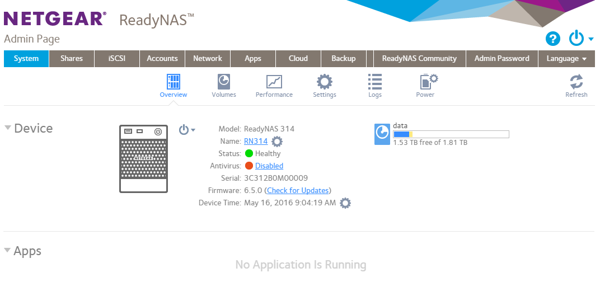

# sign-in

The `sign-in` application is a simple front-end application that runs on a mobile device, e.g., an iPad or an Android tablet that communicated with a back-end database.  This application is used as a kiosk device to collect information on visitors for a corporation.

## Nonfunctional Requirements
Design & Tool Selection Analysis

This applicattion utilizes the MEAN (MongoDB, AngularJS, Express, Node.js) Web Development Framework. Instead of AngularJS, Vue.js is used.

Framework Evaluation
Document Evaluation
NodeJS
MongoDB


## Installaction Instructions
Fork the repo then clone it to your local machine.

```
git clone https://github.com/<your username>/sign-in.git
```

Change your directory into the dir on your VirtualBox Ubuntu virtual machine.  

```
cd sign-in
``` 

Create .env file. Add a `.env` file with your PORT, MONGO_URI, 
[GITHUB_ID, GITHUB_SECRET and APP_URL](https://github.com/jaredhanson/passport-github) like this:
 
```
PORT=3000
MONGO_URI=mongodb://127.0.0.1:27017/sign-in
APP_URL=http://127.0.0.1:3000/
```

### Virtual Box Setup Instructions
These instructions assume an Ubuntu environment.
To use Vagrant, get started [here](#vagrant-setup-instructions)

### Install and run everything
```bash
$ ./bin/install.sh &
$ ./bin/init-db.sh &
$ ./bin/run-back-end.sh &
$ ./bin/frun-front-end.sh &
```


## Architecture discussion 
(no more than one paragraph)

## Plan of Action
For the plan of action, you can use Markdown's tickmark tool, e.g.

```
- [x] Nonfunctional analysis
- [ ] Architecture design
- [ ] Test deployment
...
```
## Additional features

You may implement additional features (not required) for improved grade scale:

- Admin authentication before accessing the data table
- Admin view has a page pagination
- Form entry validation
- Deploy the client on to a real tablet
- Unit testing
- Email firing off to a designated admin address when a visitor has signed in


## Visitor's View

The `sign-in` application presents to users a web form asking for some necessary information:

- Name
- Email 
- Telephone
- Company
- Official visit (checkbox)
- Escort required (checkbox)
- Escort name (if Escort is checked)

When a visitor hits `submit` the form is sent to the server and stored in a database.  The application is then redirected back to the login screen.


## Admin View

The `sign-in` application offers a password-protected admin view.  This view lists all the data from the database as a table.




