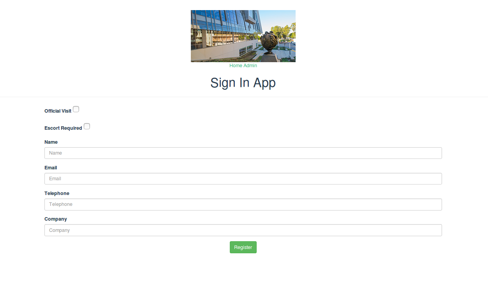
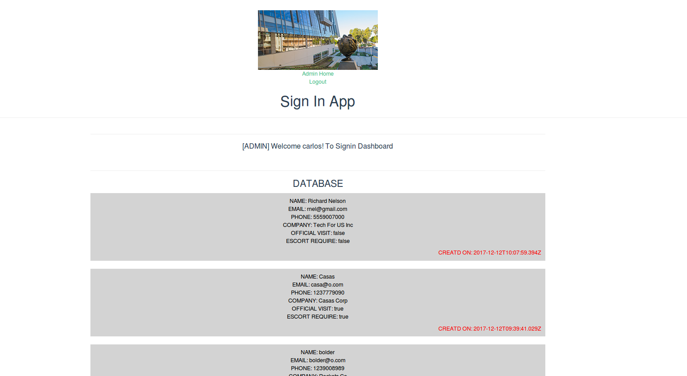
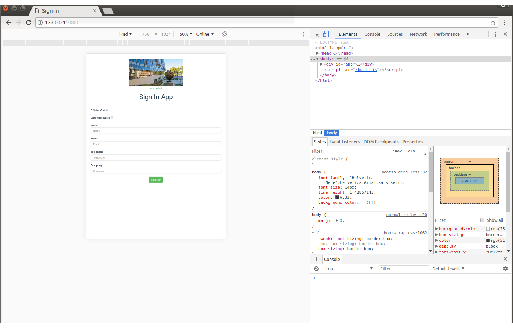
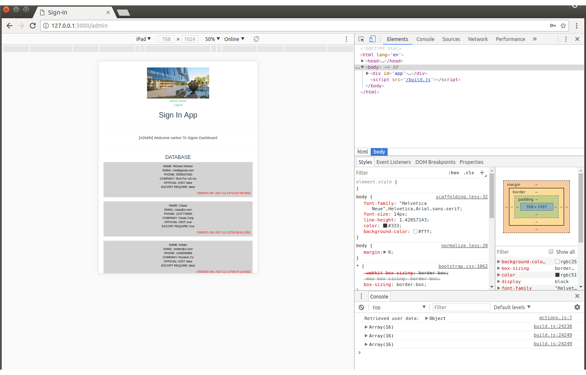

# Sign-In App

The `sign-in` application is a simple front-end application that runs on a mobile device, e.g., an iPad or an Android tablet that communicated with a back-end database.  This application is used as a kiosk device to collect information on visitors for a corporation.

## Nonfunctional Requirements
Design & Tool Selection Analysis

**MEVN**

This applicattion utilizes the **MEVN** (MongoDB, Express, Vue.js, Node.js) Web Development.

**MongoDB**

**MongoDB** was chosen because it is scalable and much simpler to deply than traditional SQL databases. MongoDB allows for fast and flexible creation data schema. Administrators may easily expand data requirements by adding more fields. Designers may also change the data type for integrity reasons. Some fields may become necessary and MongoDB allows developers to easily adjust contraints.

**Node.js**

To create this login **Node.js** was utilized because it is build from JavaScript which makes it perfect for web environments. Node.js is event-driven, non-blocking as well as lightweight and efficient. One big advantage of Node.js is its lage package ecosystem beause it is one of the biggest in the open source world.

**Vue.js**

Vue.js is a powerful JavaScript framework that is great for web applications using Node.js. Vue.js comes from the open source community and provides web development teams with invaluable set of resrouces so engineer can can overcome obstacles and challenges. The open source community is very active and developers can always refer to online documentation or tutorials.

### Documentation

**Markdown**

For Project Documentation the simple **md** markdown is perferct in order to simply create and update technical information. Markdown requires little resources and is compatible with popular IDE such as Microsoft Visual Studio.

## Installaction Instructions
Fork the repo then clone it to your local machine.

```
git clone https://github.com/<your username>/sign-in.git
```

Change your directory into the dir on your VirtualBox Ubuntu virtual machine.  

```
cd sign-in
``` 

Create .env file. Add a `.env` file with your PORT, MONGO_URI, 
[GITHUB_ID, GITHUB_SECRET and APP_URL](https://github.com/jaredhanson/passport-github) like this:
 
```
PORT=3000
MONGO_URI=mongodb://127.0.0.1:27017/sign-in
APP_URL=http://127.0.0.1:3000/
```

### Virtual Box Setup Instructions
These instructions assume an Ubuntu environment.
To use Vagrant, get started [here](#vagrant-setup-instructions)

### Install and run everything
```bash
$ ./bin/install.sh &
$ ./bin/init-db.sh &
$ ./bin/run-back-end.sh &
$ ./bin/frun-front-end.sh &
```


## Architecture Discussion 
**Sign-In App** uses a two-tier architecture which is also known as the Client-Server architecture. This application can be run locally on a user's machine or it can be deployed onto an online web server such as DigitalOcean or Amazaon Web Service.

## Plan of Action
For the plan of action, you can use Markdown's tickmark tool, e.g.


- [x] Nonfunctional analysis
- [x] Functional Requirements
- [x] Architecture 
- [x] Design
- [x] Test
- [x] Deployment


## Features

- Admin authentication before accessing the data table
- Admin view has a page with infinig scrolling
- Form entry validation


## Visitor's View

The `sign-in` application presents to users a web form asking for some necessary information:

- Name
- Email 
- Telephone
- Company
- Official visit (checkbox)
- Escort required (checkbox)
- Escort name (if Escort is checked)

When a visitor hits `submit` the form is sent to the server and stored in a database.  The application is then redirected back to the login screen.



## Admin View

The `sign-in` application offers a password-protected admin view.  This view lists all the data from the database as a table.



## iPad View (Visitors)




## iPad View (Admin)


